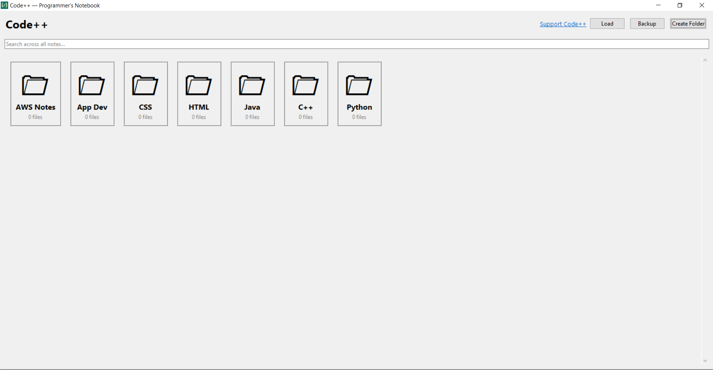
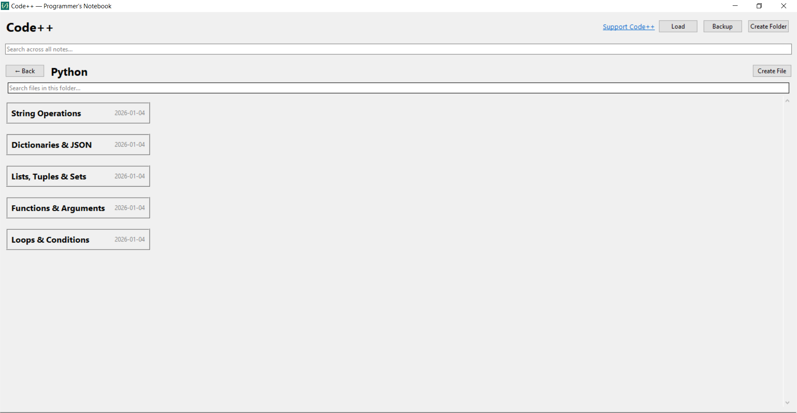
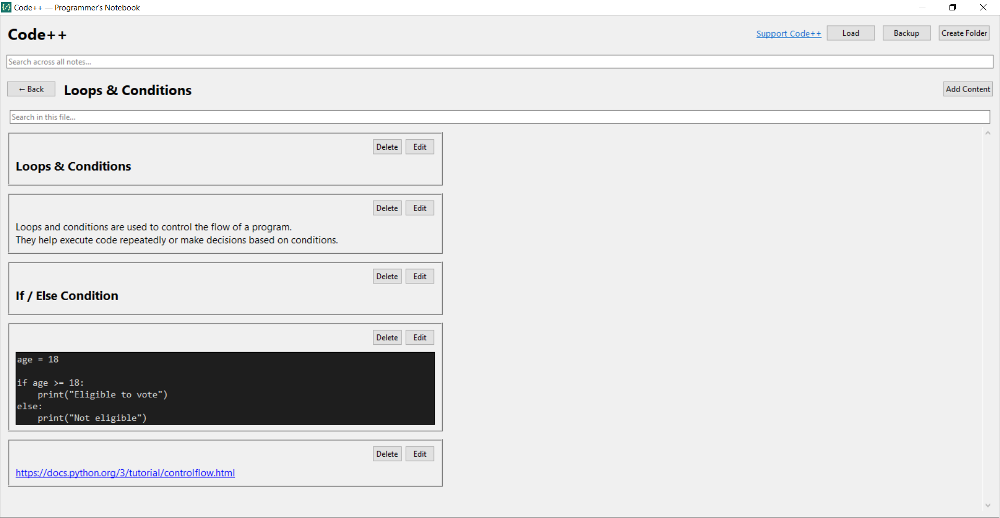
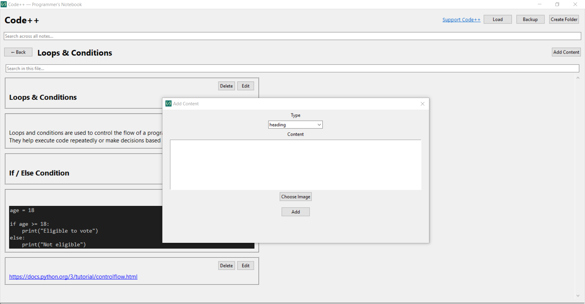

# 📘 Code++ — Programmer’s Notebook

**Code++** is a lightweight, open-source, offline notebook built specifically for programmers and students.  
It focuses on helping you **remember, organize, and reuse** programming knowledge — without cloud accounts, clutter, or distractions.

---

## 🎯 The Mission

Most note apps are generic and not built for how programmers actually work.

Code++ is built to do **one job well**:  
Help programmers store and quickly recall **syntax, commands, setups, workflows, and daily handy coding knowledge**.

It is designed as a **developer-focused, offline-first, and student-friendly tool**.

---

## 💻 Download for Windows

🔗 Download previous versions from the **Releases** section of this repository.

> [Download Latest Release Now](https://sourceforge.net/projects/codepp/)

---

## 🚀 Features

📁 **Folder-Based Organization**  
- Organize notes by languages, tools, or topics  
- Natural structure that matches how programmers think  

📄 **Concept-Based Files**  
- Each file represents a concept, task, or workflow  
- Syntax notes, setup guides, commands, deployment steps  

🧱 **Block-Based Notes**
- Headings  
- Normal text  
- Code snippets  
- Reference links  
- Images/diagrams  

🔍 **Global Search**
- Search across all folders and files instantly  
- Find syntax, commands, or steps in seconds  
- Designed to work as a **coding helpbook while you code**

📤 **Easy Import / Export**
- Export a single file or a whole folder  
- Share notes easily with friends or classmates

💾 **Local Backup**
- Can take a Local backup to prevent unwanted data loss.  

📲 **Easy Notes Sharing**
- Send exported notes via WhatsApp/Email  
- Receiver can import directly into Code++  
- No setup, no accounts, no formatting issues  

🧠 **Offline First**
- Everything stays local on your machine  
- No cloud, no login, no tracking  

🧼 **Minimal & Distraction-Free UI**
- Focused on writing and searching notes  
- No ads, no noise  

---

## 🎯 Use Cases

- Remembering programming syntax  
- Saving daily handy commands  
- Storing environment setup steps  
- Keeping deployment notes and workflows  
- Sharing notes with classmates or teammates  
- Using it as a personal **programmer’s handbook**

---

## 📸 Screenshots

| Screenshot | Description |
|----------|-------------|
|  | Home Window (Folders) |
|  | Files Window |
|  | File Detail |
|  | Create Block Popup |

---

## 🛠 Tech Stack

- **Language:** Python  
- **GUI:** Tkinter  
- **Storage:** Local JSON (`.codepp` custom extension)

---

## ⚙️ Local Setup

```bash
git clone https://github.com/mshezikhan/codepp.git
cd code++
python -m venv venv
venv\Scripts\activate         # For Windows
pip install -r requirements.txt
python main.py
```
---

## 👥 Contributing

1. Fork the repository
2. Create your feature branch: `git checkout -b feature-name`
3. Commit your changes
4. Push to your branch
5. Open a Pull Request 🚀

---

## 📄 License

[MIT License](LICENSE)
